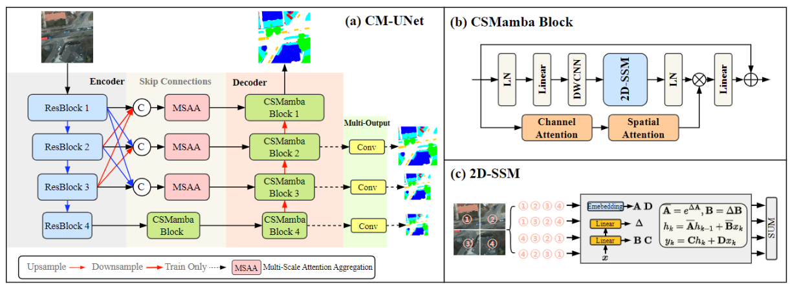
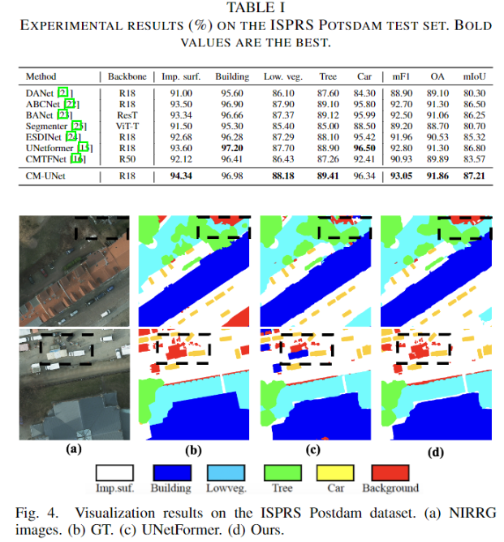
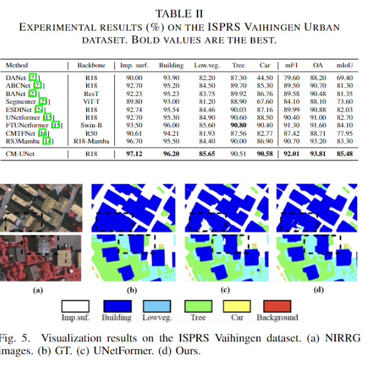
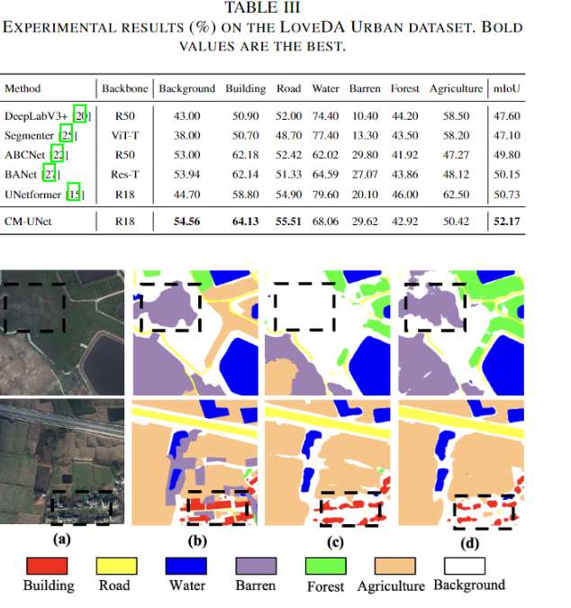

# CM-UNet: Hybrid CNN-Mamba UNet for Remote Sensing Image Semantic Segmentation
## Introduction
Official implementation of the paper [CM-UNet: Hybrid CNN-Mamba UNet for Remote Sensing Image Semantic Segmentation](https://arxiv.org/pdf/2405.10530)

## Datasets
  - [ISPRS Vaihingen and Potsdam](https://www.isprs.org/education/benchmarks/UrbanSemLab/default.aspx) 
  - [LoveDA](https://codalab.lisn.upsaclay.fr/competitions/421)


## Folder Structure
```none
├── CM-UNet (code)
├── data
│   ├── LoveDA
│   │   ├── Train
│   │   │   ├── Urban
│   │   │   │   ├── images_png (original images)
│   │   │   │   ├── masks_png (original masks)
│   │   │   │   ├── masks_png_convert (converted masks used for training)
│   │   │   │   ├── masks_png_convert_rgb (original rgb format masks)
│   │   │   ├── Rural
│   │   │   │   ├── images_png 
│   │   │   │   ├── masks_png 
│   │   │   │   ├── masks_png_convert
│   │   │   │   ├── masks_png_convert_rgb
│   │   ├── Val (the same with Train)
│   ├── vaihingen
│   │   ├── train_images (original)
│   │   ├── train_masks (original)
│   │   ├── test_images (original)
│   │   ├── test_masks (original)
│   │   ├── test_masks_eroded (original)
│   │   ├── train (processed)
│   │   ├── test (processed)
│   ├── potsdam (the same with vaihingen)
```

## Install
```
conda create -n RS python==3.8
conda install cudatoolkit==11.8 -c nvidia
pip install torch==1.10.0+cu111 torchvision==0.11.0+cu111 torchaudio==0.10.0 -f https://download.pytorch.org/whl/torch_stable.html
conda install -c "nvidia/label/cuda-11.8.0" cuda-nvcc
conda install packaging
cd CM-UNet
pip install -r requirements.txt
cd geoseg/Mamba-UNet
cd mamba
python setup.py install
cd ../ ; cd causal-conv1d
python setup.py install
```

## RUN
```
bash run_loveda.sh ${GPUID}
```

## Results

- Framework (CM-UNet)



- Results on Potsdam 



- Results on Vaihingen 



- Results on LoveDA 




<!-- 
## Citation
If you find our work, this repository, or pretrained models useful, please consider giving a star :star: and citation.
```bibtex
@article{liu2023sync,
  title={SYNC-CLIP: Synthetic Data Make CLIP Generalize Better in Data-Limited Scenarios},
  author={Liu, Mushui and He, Weijie and Lu, Ziqian and Yu, Yunlong},
  journal={arXiv preprint arXiv:2312.03805},
  year={2023}
}
``` -->

## Acknowledgement

Many thanks the following projects's contributions to **CM-UNet**.
- [Mamba-UNet](https://github.com/ziyangwang007/Mamba-UNet)
- [GeoSeg](https://github.com/WangLibo1995/GeoSeg)
- [pytorch lightning](https://www.pytorchlightning.ai/)
- [timm](https://github.com/rwightman/pytorch-image-models)
- [pytorch-toolbelt](https://github.com/BloodAxe/pytorch-toolbelt)
- [ttach](https://github.com/qubvel/ttach)
- [catalyst](https://github.com/catalyst-team/catalyst)
- [mmsegmentation](https://github.com/open-mmlab/mmsegmentation)


